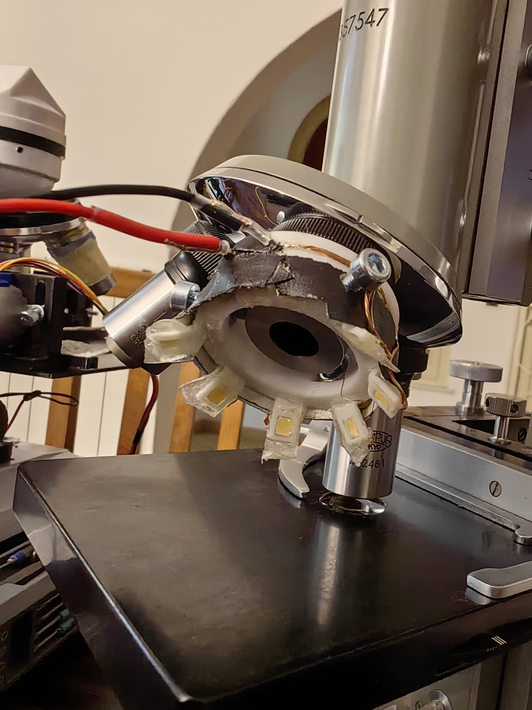
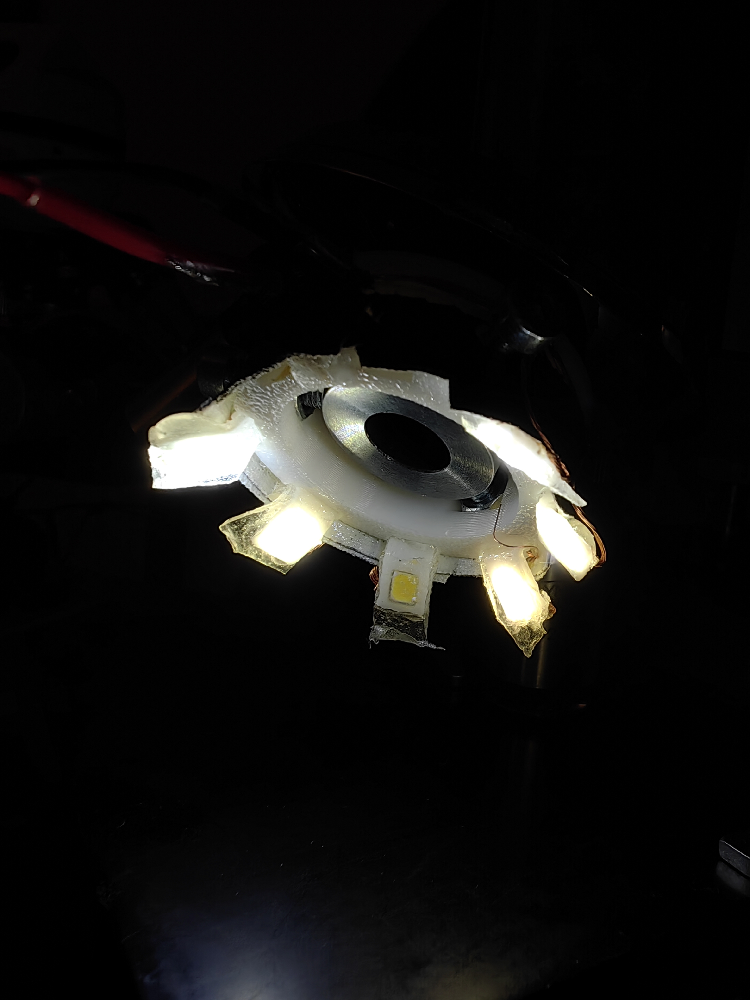
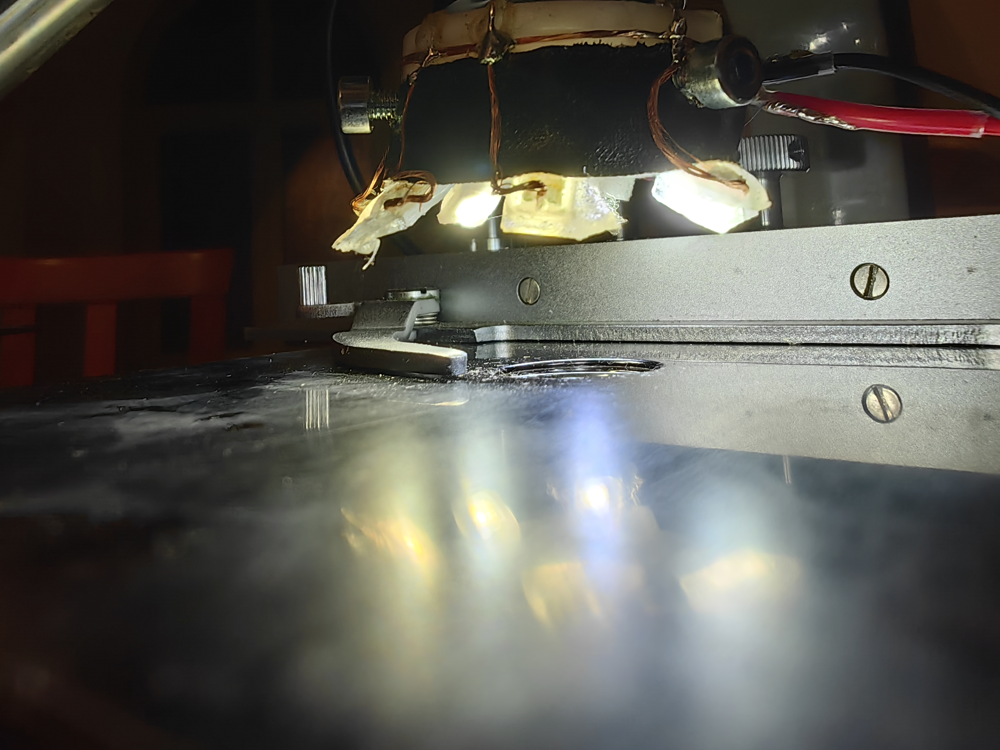
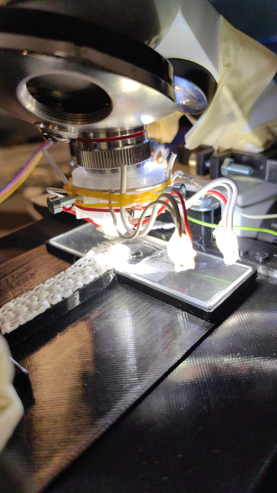
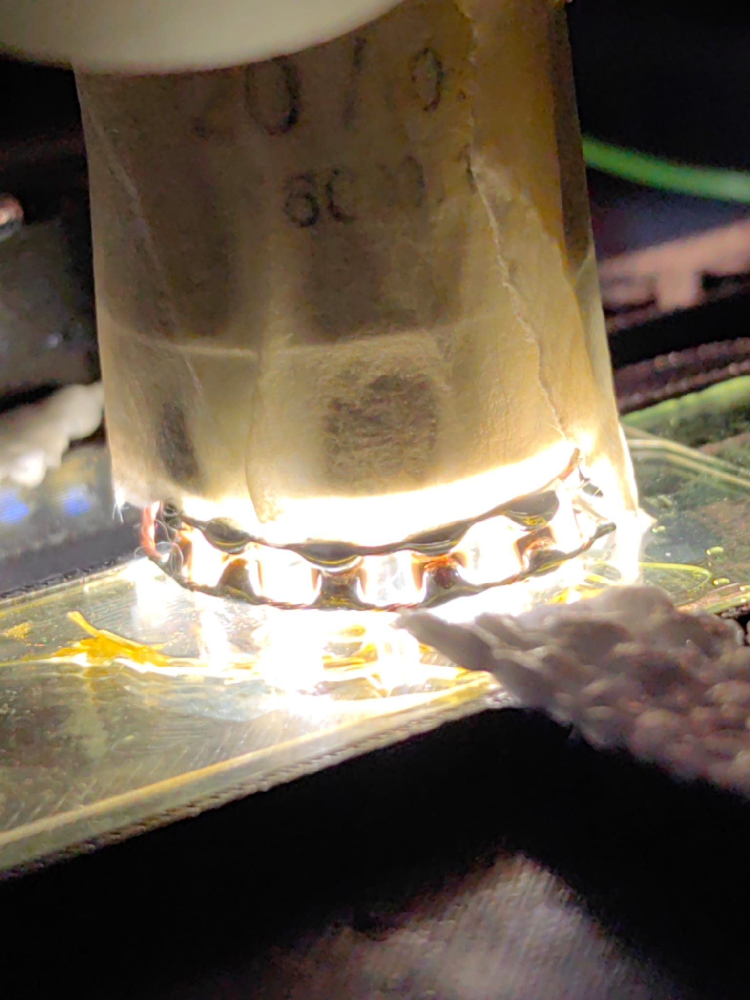

I made this top light LED ring adapter for an objective. 

I use onshape for CAD modeling, the document is publicly available for free here https://cad.onshape.com/documents/6a819d25bf1a814981881c1b/w/ef2298128430f33acb4dde79/e/52fae9879cfd158b49a84c5f

The final part consist of a ring. Each led is then mounted onto a 'developable surface' a small individual part which can be printed as once piece and then can be folded to adjust the angle of each single LED. 

The CAD files can be exported in the onshape webapplication by anyone. 
A pre-exported file of each part is here : 
https://drive.google.com/drive/folders/1DpNsnJN1ukpRQEzLvkSHA0xLCEApQeo3

Filament: i use PETG whis is more flexible (usefull for bending the foldable surfaces) and also withstands a bit more of temperature before deforming (melting). The softening temperature or temperature resistance of PETG is 85 ºC, i will measure the temperature of the LED lights with a thremal camera and will update this post later. 

I also did two erlier versions: 
V1: this version has wires that can be bent to adjust the led position. the wires were to thick and to loong and therefore the adjusting of the LED lights was unpractical. 

V2: this was just a ring of smd LEDs placed around the objective. The light was hitting perpendicular to the specimen (came 90degrees from the side). 

